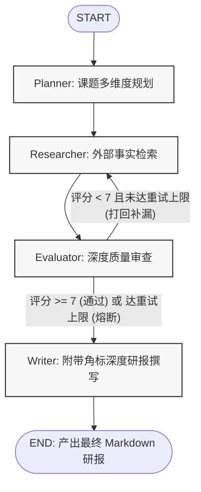

# Deep Research Agent

基于 **LangGraph**、**FastAPI** 与 **Tavily Search** 构建的工业级深度研究智能体（Deep Research Agent）。系统模拟首席行业智库分析团队的运作机制，通过「课题拆解 $\rightarrow$ 事实检索 $\rightarrow$ 严格质检 $\rightarrow$ 定向补漏 $\rightarrow$ 引用研报撰写」的闭环自反思（Self-Correction）工作流，自动产出具备事实依据与来源角标的深度研报。

---

## 目录

- [核心特性](#核心特性)
- [工作流拓扑架构](#工作流拓扑架构)
- [项目工程目录](#项目工程目录)
- [环境依赖与配置](#环境依赖与配置)
- [快速开始](#快速开始)
  - [1. 本地命令行调试](#1-本地命令行调试)
  - [2. 启动 FastAPI Web 服务](#2-启动-fastapi-web-服务)
- [API 接口与 SSE 流式协议](#api-接口与-sse-流式协议)
- [自动化测试与代码规范](#自动化测试与代码规范)

---

## 核心特性

- **模块化工程解耦**：采用核心基础设施、领域模型、提示词资产、外部工具、工作流节点与 Web 接口的分层架构，关注点清晰分离。
- **闭环智能质检与动态路由**：内置 `Evaluator` 质检主管节点，对搜集素材的硬核指标与覆盖度进行 1-10 分结构化判定；不达标自动下发补充检索关键词进行靶向补漏。
- **熔断保护机制**：针对质检打回设定最大重试阈值（`MAX_RETRY_COUNT`），防止循环耗尽模型 Token 与搜索额度。
- **严格的事实角标引用**：`Writer` 节点在陈述事实与数据时强制添加 `[1]`、`[2]` 角标，并在文末输出结构化参考来源。
- **全链路 SSE 实时流式传输**：基于 FastAPI 与 LangGraph `astream_events`，支持前端逐字流式打字效果与工作流节点状态追踪。
- **工程化日志体系**：全链路采用标准 `logging` 模块，统一时间格式、日志级别与模块溯源，告别原始 `print`。

---

## 工作流拓扑架构



---

## 项目工程目录

```text
deep_research_agent/
├── .env.example                       # 环境变量配置模板
├── pyproject.toml                     # 项目依赖与元数据管理
├── README.md                          # 项目工程文档
├── run_dev.py                         # 本地快速体验与调度脚本
├── tests/                             # 自动化测试套件 (13 个单元测试)
│   ├── __init__.py
│   ├── test_schemas.py                # 领域实体、去重与状态测试
│   ├── test_graph.py                  # 工作流图编译与条件路由决策测试
│   └── test_api.py                    # FastAPI 路由与 OpenAPI 规范测试
└── src/
    ├── __init__.py
    ├── core/                          # [核心基础设施层]
    │   ├── __init__.py
    │   ├── config.py                  # Settings 配置管理中心
    │   ├── llm.py                     # ChatOpenAI 模型客户端统一工厂
    │   └── logger.py                  # 全局日志系统配置 (setup_logging / get_logger)
    ├── schemas/                       # [数据契约与模型层]
    │   ├── __init__.py
    │   ├── domain.py                  # 领域实体 (Evidence, Plan, EvaluationResult, merge_evidences)
    │   ├── state.py                   # LangGraph 工作流全局 State 状态
    │   └── api.py                     # API 协议请求体 (ResearchRequest)
    ├── prompts/                       # [提示词资产管理层]
    │   ├── __init__.py
    │   ├── planner.py                 # Planner 课题拆解 Prompt 模板
    │   ├── evaluator.py               # Evaluator 智能质检 Prompt 模板
    │   └── writer.py                  # Writer 研报撰写 Prompt 模板
    ├── tools/                         # [外部能力扩展层]
    │   ├── __init__.py
    │   └── search.py                  # TavilyClient 延迟初始化与 web_search_tool 容错封装
    ├── agent/                         # [智能体编排核心层]
    │   ├── __init__.py
    │   ├── router.py                  # NodeName 枚举与 should_continue 条件路由
    │   ├── workflow.py                # LangGraph 状态机编排与 app 编译
    │   └── nodes/                     # 各节点独立业务实现
    │       ├── __init__.py
    │       ├── planner.py             # 规划节点
    │       ├── researcher.py          # 检索节点
    │       ├── evaluator.py           # 质检节点
    │       └── writer.py              # 撰写节点
    └── api/                           # [Web 接口与通信服务层]
        ├── __init__.py
        ├── app.py                     # FastAPI 实例工厂 create_app() 与服务启动入口
        ├── routes.py                  # API 路由注册 (/api/research/stream)
        └── streaming.py               # SSE 异步事件流生成器
```

---

## 环境依赖与配置

### 1. 基础要求
- Python $\ge$ 3.13
- [uv](https://github.com/astral-sh/uv) 包管理器（推荐）或 pip

### 2. 环境变量配置
在项目根目录下创建 `.env` 文件（参考以下配置）：

```env
# 大模型配置（支持本地 LM Studio / vLLM / Ollama 或 OpenAI 兼容端点）
OPENAI_BASE_URL=http://127.0.0.1:1234/v1
OPENAI_API_KEY=your-openai-or-local-key
MODEL_NAME=google/gemma-4-e4b

# 搜索工具配置（Tavily 专为 LLM 设计）
TAVILY_API_KEY=tvly-your-tavily-api-key

# 工作流与服务配置
MAX_RETRY_COUNT=2
SERVER_HOST=0.0.0.0
SERVER_PORT=8000
LOG_LEVEL=INFO
```

---

## 快速开始

### 1. 本地命令行调试
通过 `run_dev.py` 即可一键运行内置课题的调研全流程，终端将输出节点执行日志以及最终的 Markdown 研报：

```bash
uv run python run_dev.py
```

### 2. 启动 FastAPI Web 服务
启动 Web API 服务，提供 HTTP 与 SSE 实时数据流支持：

```bash
# 方式一：直接运行 app 模块
uv run python -m src.api.app

# 方式二：使用 uvicorn 启动
uv run uvicorn src.api.app:api --host 0.0.0.0 --port 8000 --reload
```

服务就绪后，可访问交互式 API 文档：
- Swagger UI: `http://localhost:8000/docs`
- ReDoc: `http://localhost:8000/redoc`

---

## API 接口与 SSE 流式协议

### 端点：`POST /api/research/stream`
- **Content-Type**: `application/json`
- **Accept**: `text/event-stream`

#### 请求体示例
```json
{
  "topic": "2026年具身智能商业化落地的主要工程瓶颈"
}
```

#### SSE 事件响应格式
服务通过 Server-Sent Events 流式下发消息，每条消息为标准的 `data: <JSON>\n\n` 格式：

| 事件类型 (`type`) | 说明 | 载荷示例 (`data`) |
| :--- | :--- | :--- |
| `node_start` | 工作流节点启动 | `{"type": "node_start", "node": "planner"}` |
| `status_update` | 节点完成阶段性任务 | `{"type": "status_update", "node": "researcher", "message": "新增 4 条事实素材"}` |
| `report_token` | Writer 节点研报 Token 逐字增量 | `{"type": "report_token", "content": "近年来，人形机器人..."}` |
| `complete` | 全流程正常结束信号 | `{"type": "complete"}` |
| `error` | 异常报错信息 | `{"type": "error", "message": "API key invalid"}` |

---

## 自动化测试与代码规范

### 1. 执行静态代码检查
```bash
uv run ruff check .
```

### 2. 执行自动化单元测试
套件包含数据契约去重、图编译结构校验、质检打回熔断分支、FastAPI 端点探测等：
```bash
uv run python -m unittest discover tests
```
